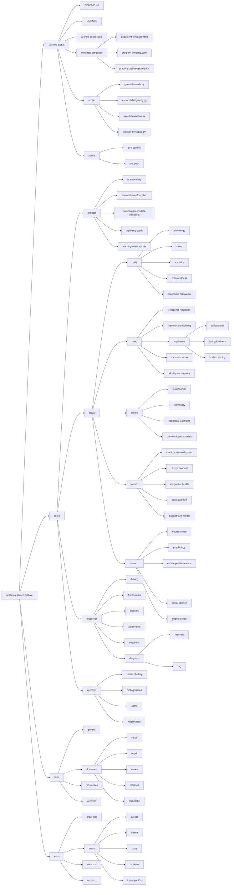

# Well-Being Source Archive directory tree diagram

```mermaid
graph LR

    A[wellbeing-source-archive] --> AG[archive-global]
    A --> EN[en-ca]
    A --> FR[fr-qc]
    A --> ES[es-la]

    %% archive-global
    AG --> AG_README[README.md]
    AG --> AG_LICENSE[LICENSE]
    AG --> AG_CFG[archive-config.yaml]
    AG --> AG_MT[metadata-templates]
    AG_MT --> AG_DT[document-template.yaml]
    AG_MT --> AG_PT[program-template.yaml]
    AG_MT --> AG_CT[practice-card-template.yaml]
    AG --> AG_SCRIPTS[scripts]
    AG_SCRIPTS --> AG_SC1[generate-cards.py]
    AG_SCRIPTS --> AG_SC2[extract-bibliography.py]
    AG_SCRIPTS --> AG_SC3[sync-translations.py]
    AG_SCRIPTS --> AG_SC4[validate-metadata.py]
    AG --> AG_HOOKS[hooks]
    AG_HOOKS --> AG_H1[pre-commit]
    AG_HOOKS --> AG_H2[pre-push]

    %% en-ca root
    EN --> EN_PROJECTS[projects]
    EN --> EN_AREAS[areas]
    EN --> EN_RES[resources]
    EN --> EN_ARCH[archives]

    %% en-ca projects
    EN_PROJECTS --> EN_P1[ace-recovery]
    EN_PROJECTS --> EN_P2[personal-transformation]
    EN_PROJECTS --> EN_P3[comparative-models-wellbeing]
    EN_PROJECTS --> EN_P4[wellbeing-cards]
    EN_PROJECTS --> EN_P5[learning-science-tools]

    %% en-ca areas
    EN_AREAS --> EN_BODY[body]
    EN_AREAS --> EN_MIND[mind]
    EN_AREAS --> EN_OTHERS[others]
    EN_AREAS --> EN_MODELS[models]
    EN_AREAS --> EN_RESEARCH[research]

    %% body subtree
    EN_BODY --> EN_BODY_PHYS[physiology]
    EN_BODY --> EN_BODY_SLEEP[sleep]
    EN_BODY --> EN_BODY_SOM[somatics]
    EN_BODY --> EN_BODY_CI[chronic-illness]
    EN_BODY --> EN_BODY_AUTO[autonomic-regulation]

    %% mind subtree
    EN_MIND --> EN_MIND_ER[emotional-regulation]
    EN_MIND --> EN_MIND_MEM[memory-and-learning]
    EN_MIND --> EN_MIND_MED[meditation]
    EN_MIND --> EN_MIND_TRAUMA[trauma-science]
    EN_MIND --> EN_MIND_ID[identity-and-agency]

    EN_MIND_MED --> EN_MIND_SATI[satipatthana]
    EN_MIND_MED --> EN_MIND_LKM[loving-kindness]
    EN_MIND_MED --> EN_MIND_SCAN[body-scanning]

    %% others subtree
    EN_OTHERS --> EN_OTH_REL[relationships]
    EN_OTHERS --> EN_OTH_COMM[community]
    EN_OTHERS --> EN_OTH_ECO[ecological-wellbeing]
    EN_OTHERS --> EN_OTH_COMMS[communication-models]

    %% models subtree
    EN_MODELS --> EN_MOD_TRIAD[triadic-body-mind-others]
    EN_MODELS --> EN_MOD_BPS[biopsychosocial]
    EN_MODELS --> EN_MOD_INT[integrative-health]
    EN_MODELS --> EN_MOD_ECOSELF[ecological-self]
    EN_MODELS --> EN_MOD_SATI[satipatthana-model]

    %% research subtree
    EN_RESEARCH --> EN_RES_NEURO[neuroscience]
    EN_RESEARCH --> EN_RES_PSY[psychology]
    EN_RESEARCH --> EN_RES_CONT[contemplative-science]
    EN_RESEARCH --> EN_RES_SOC[social-science]
    EN_RESEARCH --> EN_RES_OS[open-science]

    %% en-ca resources
    EN_RES --> EN_RES_THRIVE[thriving]
    EN_RES --> EN_RES_FW[frameworks]
    EN_RES --> EN_RES_GLOSS[glossary]
    EN_RES --> EN_RES_WS[worksheets]
    EN_RES --> EN_RES_CHK[checklists]
    EN_RES --> EN_RES_DIAG[diagrams]

    EN_RES_DIAG --> EN_RES_DIAG_MM[mermaid]
    EN_RES_DIAG --> EN_RES_DIAG_SVG[svg]

    %% en-ca archives
    EN_ARCH --> EN_ARCH_VH[version-history]
    EN_ARCH --> EN_ARCH_BIB[bibliographies]
    EN_ARCH --> EN_ARCH_NOTES[notes]
    EN_ARCH --> EN_ARCH_DEPR[deprecated]

    %% fr-qc
    FR --> FR_PROJ[projets]
    FR --> FR_DOM[domaines]
    FR --> FR_RES[ressources]
    FR --> FR_ARCH[archives]

    FR_DOM --> FR_CORPS[corps]
    FR_DOM --> FR_ESPRIT[esprit]
    FR_DOM --> FR_AUTRES[autres]
    FR_DOM --> FR_MODELES[modèles]
    FR_DOM --> FR_RECH[recherche]

    %% es-la
    ES --> ES_PROJ[proyectos]
    ES --> ES_AREAS[areas]
    ES --> ES_RES[recursos]
    ES --> ES_ARCH[archivos]

    ES_AREAS --> ES_CUERPO[cuerpo]
    ES_AREAS --> ES_MENTE[mente]
    ES_AREAS --> ES_OTROS[otros]
    ES_AREAS --> ES_MODELOS[modelos]
    ES_AREAS --> ES_INVEST[investigación]

```

