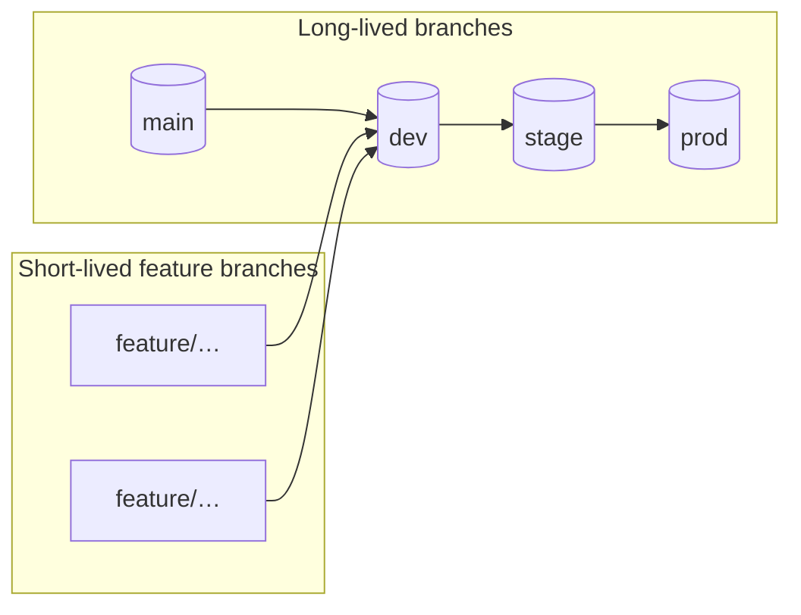
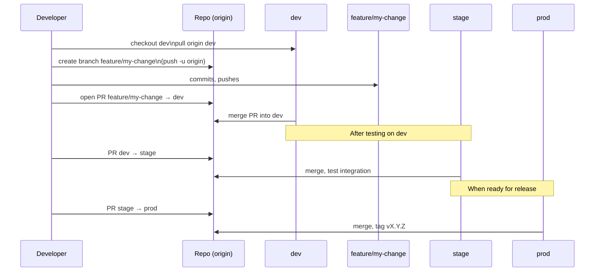

# Extended Git Workflow for source-archives-tools

This document describes a simple, developer-friendly Git workflow for the **source-archives-tools** repository.

It aims to be:

- predictable
- easy to adopt
- safe for future automation and CI

The core branches are:

- `main`  – stable, reviewed, released code only
- `dev`   – active development
- `stage` – pre-production integration and testing
- `prod`  – code that is running (or ready to run) in production-like environments

Feature work happens in short-lived branches off `dev`.

### High-level branch flow



###  Typical feature lifecycle



## Clone and Initial Setup

Clone the repository:

```bash
git clone git@github.com:<org>/source-archives-tools.git
cd source-archives-tools
```

Check the current branches:

```bash
git branch -a
```

You should see at least:

- `main`
- `remotes/origin/main`
- possibly: `remotes/origin/dev`, `remotes/origin/stage`, `remotes/origin/prod`

If `dev` exists on the remote:

```bash
git checkout dev
```

If it does not exist yet (first-time setup):

```bash
git checkout -b dev
git push -u origin dev
```

`dev` is the branch you will normally work from.

## Creating a Feature Branch

Always do new work in a **feature branch**, not directly on `dev`.

```bash
git checkout dev
git pull origin dev  # make sure you're up to date

git checkout -b feature/<short-name>
```

Examples:

- `feature/init-archive-kiss`
- `feature/language-standards-doc`
- `feature/example-civic-lattice-template`

Work normally:

```bash
# edit files
git status
git add <files>
git commit -m "Short, clear commit message"
```

When you’re ready to share or open a pull request:

```bash
git push -u origin feature/<short-name>
```

------

## Merging Feature Branches into `dev`

The recommended flow is via pull requests (even if you are the only developer); this keeps history and review clean.

1. Push your feature branch:

   ```bash
   git push -u origin feature/<short-name>
   ```

2. Open a pull request on the platform (e.g., GitHub) from:

   ```text
   feature/<short-name> -> dev
   ```

3. Review, adjust if needed, then merge.

4. Once merged, you can safely delete the feature branch:

   ```bash
   git branch -d feature/<short-name>        # local
   git push origin --delete feature/<short-name>  # remote
   ```

------

## Promoting Changes

Moving from dev -> stage -> prod

This repository supports a simple promotion model:

1. **`dev`** – where features land and are tested in isolation
2. **`stage`** – where integration testing happens
3. **`prod`** – code considered ready for real use

### Update `stage` from `dev`

```bash
git checkout stage
git pull origin stage

git merge --no-ff dev
git push origin stage
```

If you prefer, you can also use a pull request:

```text
dev -> stage
```

### Update `prod` from `stage`

Only after you’re satisfied with `stage`:

```bash
git checkout prod
git pull origin prod

git merge --no-ff stage
git push origin prod
```

Again, a PR `stage -> prod` is recommended for traceability.

------

## Tagging Versions (e.g., v0.0.1)

When `prod` (or `dev`, during early experimentation) reaches a meaningful checkpoint, create a tag.

1. Make sure you are on the branch you want to tag (often `prod` or `dev` early on):

   ```bash
   git checkout dev
   git pull origin dev
   ```

2. Create an annotated tag:

   ```bash
   git tag -a v0.0.1 -m "Initial KISS tooling, init script, README, minimal standards structure"
   ```

3. Push the tag:

   ```bash
   git push origin v0.0.1
   ```

You can list tags with:

```bash
git tag
```

------

## Typical Daily Flow

A normal development day looks like:

```bash
# 1. Start on dev and get latest changes
git checkout dev
git pull origin dev

# 2. Create a feature branch
git checkout -b feature/small-improvement

# 3. Work, commit
# ...edit files...
git add .
git commit -m "Describe the change"

# 4. Push feature branch
git push -u origin feature/small-improvement

# 5. Open PR: feature/small-improvement -> dev
#    Review, merge, delete branch when done
```

Promotion to `stage` and `prod` happens less frequently and intentionally, not on every commit.

------

## Safety Tips

- Avoid committing directly to `main`, `stage`, or `prod`.
- Keep `dev` up to date before branching (`git pull origin dev`).
- Use small, focused feature branches to keep diffs manageable.
- Tag versions when you reach stable checkpoints (even early ones).
- Consider protecting `main`, `stage`, and `prod` in your Git hosting platform so they require pull requests.

------

You can extend this document later with:

- CI rules (what runs on `dev` vs `stage` vs `prod`)
- naming conventions for hotfix branches (e.g., `hotfix/…`)
- links to internal docs or diagrams

For now, this keeps everything **simple, explicit, and enough to avoid surprises.**