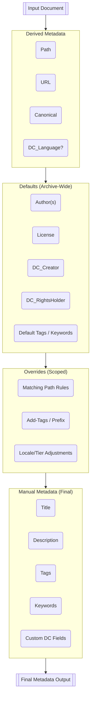

# Metadata Layering Model for the Sovereign Archive Toolkit

This document defines the full **four-layer metadata hierarchy** for Sovereign Archives.  
It explains how final metadata for any document is constructed from:

- Derived (structural)
- Defaults (archive-wide)
- Overrides (section/taxonomy-based)
- Manual (author-defined)

It also provides a Mermaid diagram and describes how the layers interact with your archive tools.

This document updates and supersedes previous internal drafts, and represents the **finalized canonical model** for SAT metadata resolution.

# The Four Metadata Layers (Final Model)



Metadata for every document is composed by applying four layers in a strict order of precedence, from lowest to highest.

## Derived Metadata  
Computed exclusively from file system structure and archive configuration.

Examples:
- `Path`
- `URL`
- `Canonical`
- optionally `DC_Language`

Rules:
- Always recalculated by tools
- Never manually edited in documents
- Lowest precedence, but special: *manual values do not override derived values*

This layer is produced by tools like `sat-refresh-path-metadata`.

---

## Defaults (Archive-Wide)

Defined in:

```
config/metadata_defaults.yml
```

Examples:
- `Author`
- `License`
- `DC_Creator`
- `DC_RightsHolder`
- baseline `Tags`, `Keywords`

Rules:
- Applied only when the field is missing
- Never overwrite existing metadata
- Provide a consistent identity/rights baseline
- Ideal for archives with one or a few main authors

This layer is managed by tools such as `sat-fill-default-metadata`.

---

## Overrides (Contextual / Scoped)

Defined in:

```
config/metadata_scopes.yml
```

These rules modify metadata based on:

- path prefixes
- taxonomy nodes
- locale roots
- content type

Examples:
- all research pages add tags: `["research", "evidence"]`
- well-being practices automatically prefix DC_Subject
- fr-ca/ sets a different DC_Language or Author group

Rules:
- Higher precedence than Defaults
- Lower precedence than Manual
- Only modify fields explicitly specified
- Never modify Derived metadata

Overrides are the “section conventions” of the archive.

---

## Manual Metadata (Highest Precedence)

Defined directly in each document’s YAML front matter.

Examples:
- `Title`
- `Description`
- `Tags`
- `Keywords`
- specific subject lines
- research annotations

Rules:
- Always wins except against Derived metadata
- Tools never overwrite manual metadata unless specifically told to
- Represents the author’s explicit intent

This is the final and most authoritative layer.

---

# Precedence Summary

From lowest to highest:

```
1. Derived  
2. Defaults  
3. Overrides  
4. Manual
```

Derived is special because the system needs consistent location metadata.

Manual metadata represents final user intent.

Overrides enrich or modify metadata contextually.

Defaults provide missing identity/rights metadata that would otherwise repeat across documents.

---

# Mermaid Diagram: Metadata Resolution Flow

````mermaid
flowchart TD

    subgraph L0[Derived Metadata]
      D1(Path)
      D2(URL)
      D3(Canonical)
      D4(DC_Language?)
    end

    subgraph L1[Defaults (Archive-Wide)]
      F1(Author(s))
      F2(License)
      F3(DC_Creator)
      F4(DC_RightsHolder)
      F5(Default Tags / Keywords)
    end

    subgraph L2[Overrides (Scoped)]
      O1(Matching Path Rules)
      O2(Add-Tags / Prefix)
      O3(Locale/Tier Adjustments)
    end

    subgraph L3[Manual Metadata (Final)]
      M1(Title)
      M2(Description)
      M3(Tags)
      M4(Keywords)
      M5(Custom DC Fields)
    end

    D0[[Input Document]] --> L0
    L0 --> L1
    L1 --> L2
    L2 --> L3
    L3 --> FOUT[[Final Metadata Output]]
````

This diagram defines the canonical flow that all SAT-compatible tools should follow.

---

# Example Metadata Resolution

Given a file:

```
en-ca/resources/research/aces-and-health.md
```

The system resolves metadata as follows:

### Derived:
```
Path, URL, Canonical
```

### Defaults:
```
Author: ["Christopher Steel"]
License: "CC BY-SA 4.0"
```

### Overrides (research scope):
```
Tags: ["research", "evidence"]
DC_Subject Prefix: "Research:"
```

### Manual:
```
Tags: ["trauma"]
Title: "ACEs and Health"
```

### Final merged result:

```yaml
Title: "ACEs and Health"
Author: ["Christopher Steel"]
License: "CC BY-SA 4.0"

Tags:
  - "trauma"
  - "research"
  - "evidence"

Path: "en-ca/resources/research/aces-and-health.md"
URL: "/en-ca/resources/research/aces-and-health"
Canonical: "/en-ca/resources/research/aces-and-health"
```

This preserves manual intent, respects section conventions, and maintains structural metadata.

---

# Relationship to Tools

Every tool in the SAT ecosystem interacts with a specific layer:

- `sat-refresh-path-metadata` → Derived  
- `sat-fill-default-metadata` → Defaults  
- future `sat-apply-metadata-scopes` → Overrides  
- author editing → Manual  

Because the layering model is stable and predictable, tools can be built independently while guaranteeing consistent outcomes.

---

# Recommended Next Steps

To fully operationalize this model:

1. Implement **`sat-fill-default-metadata` v0.1** (diff-only)  
2. Introduce a stub **`metadata_scopes.yml`** for Overrides  
3. Update the `sat` toolchain documentation to reference this hierarchy  
4. Create a test archive with mixed metadata conditions to validate all layers

---

# License

This document, *Metadata Layering Model for the Sovereign Archive Toolkit*, by **Christopher Steel**, with AI assistance from **ChatGPT-5.1 (OpenAI)**, is licensed under the [Creative Commons Attribution-ShareAlike 4.0 License](https://creativecommons.org/licenses/by-sa/4.0/).


