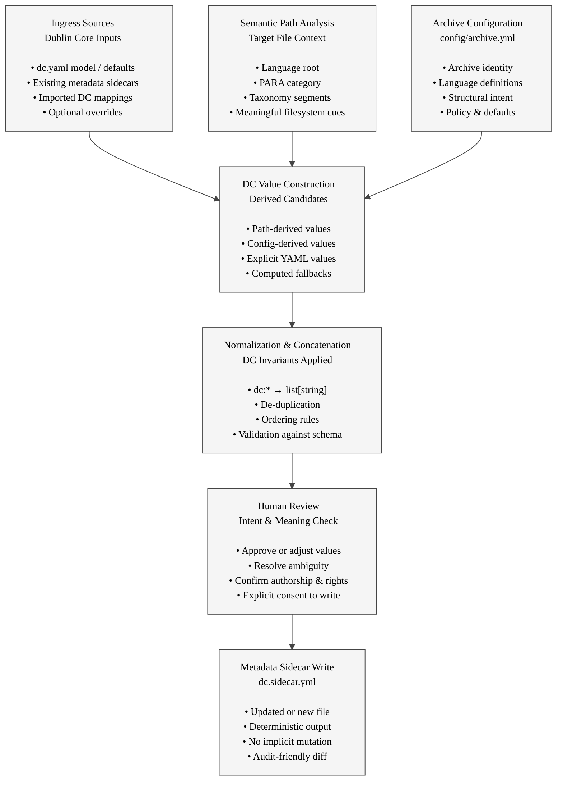

## Dublin Core Metadata Ingress, Review, and Sidecar Generation

### Ingress Sources

Ingress defines **what information is available**, not what is authoritative.

- YAML-based Dublin Core models or templates
- Pre-existing metadata sidecars
- Imported mappings from external systems
- Optional, explicit overrides only

No single ingress source is assumed to be complete.

[Return to chart](#dublin-core-ingress-review-sidecar-generation-chart)

### Semantic Path Analysis

Filesystem paths carry **structured meaning**.

- Language and locale cues
- PARA placement signals intent
- Taxonomy segments imply subject and scope
- Paths are interpreted, not enforced

Meaning is inferred cautiously and transparently.

[Return to chart](#dublin-core-ingress-review-sidecar-generation-chart)

### Archive Configuration

Archive configuration provides **contextual authority**.

- Defines archive-level identity
- Establishes structural expectations
- Supplies defaults and policies
- Applies uniformly across content

Configuration informs metadata without embedding it.

[Return to chart](#dublin-core-ingress-review-sidecar-generation-chart)

### DC Value Construction

This stage assembles **candidate values**.

- Explicit values take precedence
- Derived values fill gaps
- Multiple sources may contribute
- No mutation occurs yet

All candidates remain provisional.

[Return to chart](#dublin-core-ingress-review-sidecar-generation-chart)

### Normalization & Concatenation

Normalization enforces **core invariants**.

- Every `dc:*` field becomes `list[string]`
- Duplicate values are removed
- Ordering rules are applied
- Schema validation is performed

After this step, the DC map is internally coherent.

[Return to chart](#dublin-core-ingress-review-sidecar-generation-chart)

### Human Review

Human review is the **ethical and semantic checkpoint**.

- Confirms intent and meaning
- Resolves ambiguity machines cannot
- Verifies authorship, rights, and context
- Explicitly authorizes persistence

No metadata is written without human consent.

[Return to chart](#dublin-core-ingress-review-sidecar-generation-chart)

### Metadata Sidecar Write

Sidecar writing is **explicit and deterministic**.

- Writes a new or updated sidecar file
- Produces stable, reviewable diffs
- Never mutates content files
- Can be rerun safely

The sidecar becomes the persisted expression of metadata intent.

[Return to chart](#dublin-core-ingress-review-sidecar-generation-chart)

## License

This document, *Dublin Core Metadata Ingress, Review, and Sidecar Generation*, by **Christopher Steel**, with AI assistance from **Euria (Infomaniak)**, is licensed under the [Creative Commons Attribution-ShareAlike 4.0 License](https://creativecommons.org/licenses/by-sa/4.0/).

