## Dublin Core Triage Pipeline

```mermaid
flowchart TD
    A["**Title**
        Required First identifier
        for relevance & discovery"] --> B["**Creator**
        Who published or authored?
        Assesses credibility"]
    B --> C["**Subject**
        Keywords/topics
        Enables categorization"]
    C --> D["**Description**
        Abstract/summary
        Quick content understanding"]
    D --> E["**Publisher**
        Organization responsible
        Trust & source evaluation"]
    E --> F["**Date**
        Publication/modification
        Timeliness & currency"]
    F --> G["**Type**
        Document format
        (e.g., article, report)"]
    G --> H["**Format**
        File type (HTML, PDF)
        Accessibility & processing"]
    H --> I["**Identifier**
        URL, DOI, ID
        For referencing & retrieval"]
    I --> J["**Language**
        Content language
        Localization & filtering"]
    J --> K["**Relation**
        Related resources
        Context & expansion"]
    K --> L["**Coverage**
        Spatial/temporal scope
        Niche use cases"]
    L --> M["**Rights**
        Copyright/license
        Reuse permissions"]
    M --> N["**Source**
        Parent document/collection
        Provenance tracking"]
    N --> O["**Audience**
        Target readership
        Low priority in triage"]
    O --> P["**End**
        Document Triage Complete"]

    click A "#title"
    click B "#creator"
    click C "#subject"
    click D "#description"
    click E "#publisher"
    click F "#date"
    click G "#type"
    click H "#format"
    click I "#identifier"
    click J "#language"
    click K "#relation"
    click L "#coverage"
    click M "#rights"
    click N "#source"
    click O "#audience"
    click P "#end"
```

### 1. Title  
**Definition**: The primary identifier of the document.  

- Required for discovery and relevance filtering  
- Often used as the first sorting or display field  
- Return to chart: [Dublin Core Triage Pipeline Chart](#dublin-core-triage-pipeline-chart)

---

### 2. Creator  
**Definition**: The individual or organization responsible for creating the content.  
- Helps assess authority and bias  
- Useful for filtering by known publishers or authors  
- Return to chart: [Dublin Core Triage Pipeline Chart](#dublin-core-triage-pipeline-chart)

---

### 3. Subject  
**Definition**: Keywords or controlled vocabulary describing the topic.  
- Enables categorization and search relevance  
- Often mapped to taxonomies or ontologies  
- Return to chart: [Dublin Core Triage Pipeline Chart](#dublin-core-triage-pipeline-chart)

---

### 4. Description  
**Definition**: A summary or abstract of the document’s content.  
- Allows quick understanding without full reading  
- Critical for automated filtering or previewing  
- Return to chart: [Dublin Core Triage Pipeline Chart](#dublin-core-triage-pipeline-chart)

---

### 5. Publisher  
**Definition**: The entity responsible for making the document available.  
- Indicates institutional backing or editorial standards  
- Useful for source credibility assessment  
- Return to chart: [Dublin Core Triage Pipeline Chart](#dublin-core-triage-pipeline-chart)

---

### 6. Date  
**Definition**: When the document was published or last modified.  
- Essential for timeliness and currency  
- Filters outdated or obsolete content  
- Return to chart: [Dublin Core Triage Pipeline Chart](#dublin-core-triage-pipeline-chart)

---

### 7. Type  
**Definition**: The nature or genre of the document.  
- E.g., “article”, “dataset”, “white paper”  
- Affects how it’s processed or displayed  
- Return to chart: [Dublin Core Triage Pipeline Chart](#dublin-core-triage-pipeline-chart)

---

### 8. Format  
**Definition**: The file or encoding format of the document.  
- E.g., “HTML”, “PDF”, “JSON”  
- Impacts accessibility, parsing, and rendering  
- Return to chart: [Dublin Core Triage Pipeline Chart](#dublin-core-triage-pipeline-chart)

---

### 9. Identifier  
**Definition**: A unique, persistent reference to the document.  
- E.g., URL, DOI, ISBN  
- Required for citation, retrieval, or deduplication  
- Return to chart: [Dublin Core Triage Pipeline Chart](#dublin-core-triage-pipeline-chart)

---

### 10. Language  
**Definition**: The language in which the document is written.  
- Enables filtering by locale or translation needs  
- Often used in multilingual systems  
- Return to chart: [Dublin Core Triage Pipeline Chart](#dublin-core-triage-pipeline-chart)

---

### 11. Relation  
**Definition**: Links to related resources (e.g., series, translations, derivatives).  
- Adds context or expands scope  
- Optional in triage unless tracking networks  
- Return to chart: [Dublin Core Triage Pipeline Chart](#dublin-core-triage-pipeline-chart)

---

### 12. Coverage  
**Definition**: Spatial or temporal scope of the content.  
- E.g., “Europe, 2020–2025”  
- Rarely used in general triage; niche for geospatial or historical archives  
- Return to chart: [Dublin Core Triage Pipeline Chart](#dublin-core-triage-pipeline-chart)

---

### 13. Rights  
**Definition**: Copyright, license, or usage permissions.  
- Critical for reuse, redistribution, or compliance  
- Often deferred until final processing stage  
- Return to chart: [Dublin Core Triage Pipeline Chart](#dublin-core-triage-pipeline-chart)

---

### 14. Source  
**Definition**: Where the document originated or was derived from.  
- E.g., parent collection, journal, dataset  
- Useful for provenance or version tracking  
- Return to chart: [Dublin Core Triage Pipeline Chart](#dublin-core-triage-pipeline-chart)

---

### 15. Audience  
**Definition**: Intended readership or user group.  
- E.g., “academics”, “general public”  
- Lowest priority in triage unless targeting specific users  
- Return to chart: [Dublin Core Triage Pipeline Chart](#dublin-core-triage-pipeline-chart)

---

### End: Document Triage Complete  
**Definition**: The document has been fully assessed and categorized.  
- Ready for storage, indexing, or human review
- Return to chart: [Dublin Core Triage Pipeline Chart](#dublin-core-triage-pipeline-chart)

---

## License

This document, **Dublin Core Triage Pipeline**, by **Christopher Steel**, with AI assistance from **Euria (Infomaniak)**, is licensed under the [Creative Commons Attribution-ShareAlike 4.0 International License](https://creativecommons.org/licenses/by-sa/4.0/).

You are free to:
- **Share** — copy and redistribute the material in any medium or format
- **Adapt** — remix, transform, and build upon the material for any purpose, even commercially

Under the following terms:
- **Attribution** — You must give appropriate credit, provide a link to the license, and indicate if changes were made.
- **ShareAlike** — If you remix, transform, or build upon the material, you must distribute your contributions under the same license as the original.

---

*Euria is an ethical, Swiss-hosted AI assistant developed by Infomaniak. No data is stored. Powered by renewable energy.*
