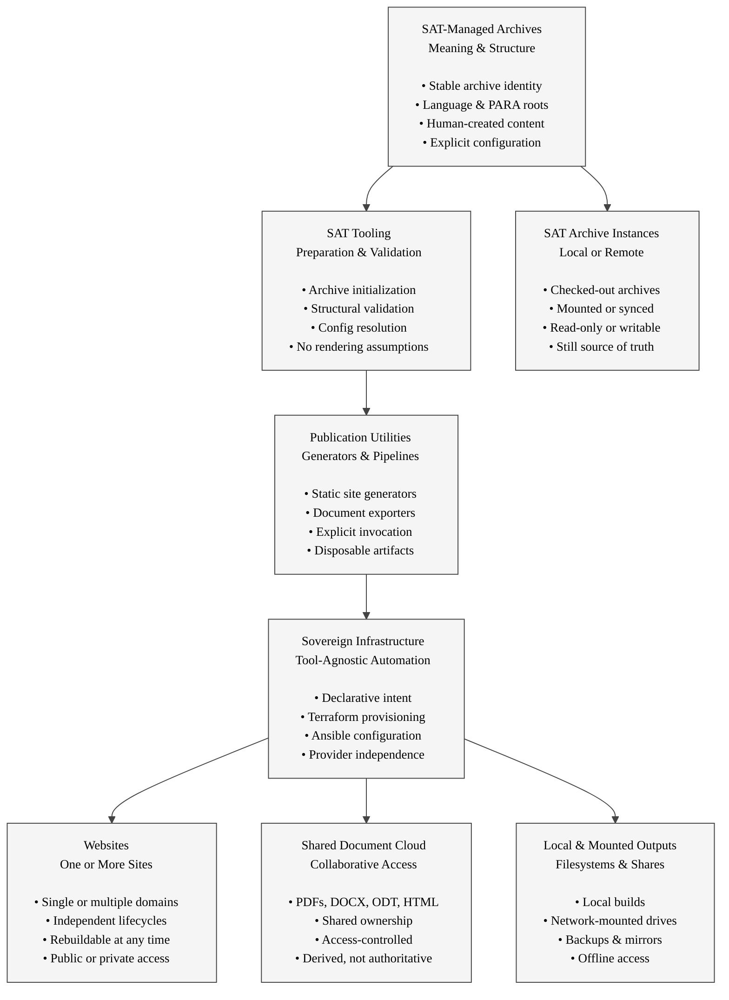

## From Sovereign Archives and Infrastructure to Multiple Output Forms

### SAT-Managed Archives

Archives are the **authoritative source of meaning**.

- Content, structure, and identity live here
- Independent of publication or distribution platforms
- Valid even with zero outputs
- Protected from accidental coupling

[Return to chart](#archives-infrastructure-multi-output-chart)

### SAT Tooling

SAT tools prepare archives for safe use.

- Act only when explicitly invoked
- Validate structure and configuration
- Never interpret or transform meaning
- Define clear system boundaries

[Return to chart](#archives-infrastructure-multi-output-chart)

### Publication Utilities

Publication utilities transmogrify selected archive content for specific content generators.

- Generate web sites, shared storage and documents
- Apply renderer-specific logic
  - markdown -> word
  - directory tree -> website
  - archive to shared drive

- Are optional and replaceable
- Never feed back changes to source archive(s) implicitly

[Return to chart](#archives-infrastructure-multi-output-chart)

### Sovereign Infrastructure Automation

Infrastructure realizes distribution intent.

- Encodes ownership and exit strategy
- Separates provisioning from configuration
- Supports many outputs simultaneously
- Avoids vendor, platform and medium(physical, cloud..) lock-in

#### Current State

* working in the wild

[Return to chart](#archives-infrastructure-multi-output-chart)

### Websites

Websites are **one expression** of the archive.

- May be single or multiple sites
- Each has its own lifecycle
- Can be destroyed and rebuilt
- Never authoritative over content

#### Current State

* Working in the wild

[Return to chart](#archives-infrastructure-multi-output-chart)

### Shared Document Cloud

Document clouds provide **collaborative access**.

- Host exported documents
- Support sharing and review
- Enforce access controls
- Remain downstream of archives

#### Current State

* Valid concept using existing infra & tools
* Would requires significant additional SAT tooling for remote management of data pools via SAT. Significantly easier directly using existing proprietary and/or opensource role and access rights for the time being

[Return to chart](#archives-infrastructure-multi-output-chart)

### Local & Mounted Outputs

Local and mounted outputs support **offline and operational needs**.

- Enable local review and testing
- Support backups and mirrors
- Allow air-gapped workflows
- Do not redefine truth

#### Current State

* opensource tools exist (git, git gui's)
* likely to require end user training
* learning curve, but technology that has widespread adoption in many areas (tech, engineering, linux core, most opensource software)
* Could be used in carefully automated ways using pull

[Return to chart](#archives-infrastructure-multi-output-chart)

### SAT Archive Instances

Archive instances are **replicas of authority**, not derivatives.

- May exist locally or remotely
- Can be mounted or synchronized
- Remain governed by SAT rules
- Preserve meaning and structure intact

#### status

* works as a simple copy/duplicate
* significant work to be done if synchronization (failover instances) are desired. Backups work Sync might be good for geographically distributed failover but in many cases the easiest remedy would be a git repository clone or installation

[Return to chart](#archives-infrastructure-multi-output-chart)

## License

This document, *From Sovereign Archives and Infrastructure to Multiple Output Forms*, by **Christopher Steel**, with AI assistance from **Euria (Infomaniak)**, is licensed under the [Creative Commons Attribution-ShareAlike 4.0 License](https://creativecommons.org/licenses/by-sa/4.0/).

