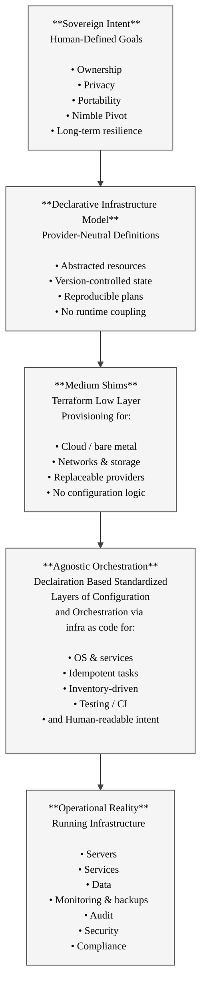

## Sovereign and Tool-Agnostic Infrastructure Automation

## Description

A thoughtfully designed sovereign and agnostic leaning pipeline that makes use of highly trusted open source tools and utilities can be leveraged to create automation pipelines in order to enable maximum pivot allow. This allows for movement towards systems and architectures that do not rely on external products and services that leverage vendor lock-in.

This is in turn requires a good meta view of the various methods employed and how to avoid and or mitigate them.

The most costly external systems tend to accomplish this through what is sometimes referred to as holding data hostage.

Using an agnostic leaning and sovereignty enabled automation pipeline can be complimented with Sovereign Archive Tools which allow for the management, control and ownership of content which can then be transmogrified for ingress (output) to external systems and formats of all types.

So over time, changes and advancements in technologies, pricing strategies as well as vendor lock in can be negotiated more successfully or migration away from a particular service or product done with significantly more grace.

While this very different approach does cost more, initially, short, mid and longer term savings can by very significant in terms of finance as well as in-house expertise and availability for maintaining an agile stance and the resources required to fund it.

In turn this requires an organization desires this and is able to measure success over the longer term.

While many startups and even major corporations are unable or unwilling to consider longer term outcomes, as penalties for use of externally controlled tools and data accumulate by government, health, education and social benefit ngo's may lead the move to, well moving.

At the other end of the spectrum, many individual users of external products and services find that they too are paying more and getting less from services that effectively leverage their content, on-line stores and other required on-line services in order to continue operating.

### Sovereign Intent

Sovereignty begins with **explicit human intent**.

- Infrastructure exists to serve people and organizations
- Exit strategies are planned from the start
- Control is retained over data, identity, and operation
- No dependency is accepted without justification

[Return to chart](#sovereign-tool-agnostic-infrastructure-automation-chart)

### Declarative Infrastructure Model

This layer encodes intent without execution.

- Describes *what should exist*, not how to click for it
- Lives in version control
- Can be reviewed, audited, and forked
- Decouples meaning from tools

[Return to chart](#sovereign-tool-agnostic-infrastructure-automation-chart)

### Terraform

Terraform provisions **resources**, not systems.

- Creates infrastructure primitives
- Supports multiple providers
- Allows migration without redesign
- Stops at the boundary of configuration

Terraform is replaceable by design.

[Return to chart](#sovereign-tool-agnostic-infrastructure-automation-chart)

### Ansible

Ansible configures **systems and behavior**.

- Applies idempotent state
- Uses inventories as contracts
- Keeps logic readable and auditable
- Avoids hidden execution paths

Ansible enforces intent without locking ownership.

[Return to chart](#sovereign-tool-agnostic-infrastructure-automation-chart)

### Running Infrastructure

This is the live outcome — not the source of truth.

- Can be destroyed and rebuilt
- Must be observable and recoverable
- Never treated as authoritative
- Always derived from declared state

Infrastructure is a result, not a definition.

[Return to chart](#sovereign-tool-agnostic-infrastructure-automation-chart)

## License

This document, *Sovereign and Tool-Agnostic Infrastructure Automation Using Terraform and Ansible*, by **Christopher Steel**, with AI assistance from **Euria (Infomaniak)**, is licensed under the [Creative Commons Attribution-ShareAlike 4.0 License](https://creativecommons.org/licenses/by-sa/4.0/).

