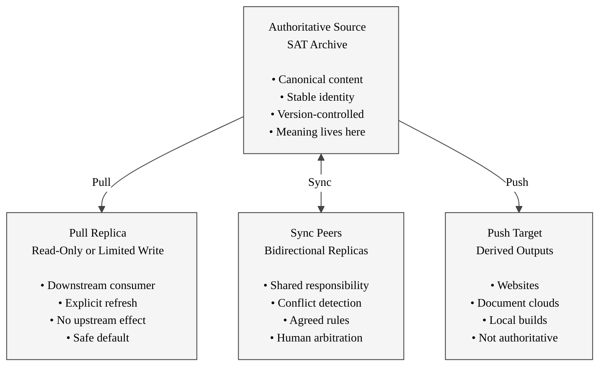

## Pull–Sync–Push Synchronization Model

### Authoritative Source

The SAT archive is the **source of truth**.

- All meaning originates here
- History and intent are preserved
- Other locations derive from it
- Loss elsewhere does not affect authority

[Return to chart](#pull-sync-push-model-chart)

### Pull Replica

Pull-based replicas are **safe consumers**.

- Data is fetched explicitly
- Local changes do not propagate upstream
- Ideal for review, testing, and publication
- Default model for most workflows

Typical tools: SyncToy Echo, rsync pull, read-only mounts.

[Return to chart](#pull-sync-push-model-chart)

### Sync Peers

Sync implies **shared authority**.

- Changes may flow in both directions
- Conflicts are possible and expected
- Requires rules, trust, and human oversight
- Best used sparingly

Typical tools: SyncToy Synchronize, uSync bidirectional, Syncthing.

[Return to chart](#pull-sync-push-model-chart)

### Push Target

Push targets receive **derived artifacts**.

- Outputs only, never source
- Can be regenerated at any time
- Failure is recoverable
- No feedback into archives

Typical targets: web servers, document clouds, mounted shares.

[Return to chart](#pull-sync-push-model-chart)

## License

This document, *SyncToy / uSync Pull–Sync–Push Model*, by **Christopher Steel**, with AI assistance from **Euria (Infomaniak)**, is licensed under the [Creative Commons Attribution-ShareAlike 4.0 License](https://creativecommons.org/licenses/by-sa/4.0/).

