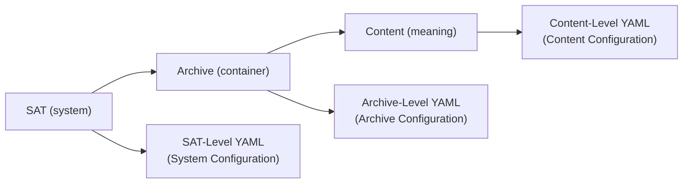

# sat-configuration-scopes.md

## Description

SInce we have committed to **three classes of tools** we also need to commit **three scopes of configuration**, otherwise boundaries will blur immediately.

Below is a **clean, SAT-native configuration model** that matches current tool taxonomy and preserves the core principle that: *nothing is read implicitly*.

## Goals

SAT rules **described**, not embedded

Documentation **auditable**

Concepts **publishable**

# Configuration Scoping Model

There are **three distinct configuration scopes**, each with an explicit home, ownership, and read contract.

### Configuration Scope Flowchart



Text rendition:

```text
SAT (system) -> Archive (container) -> Content (meaning)
```

Each layer **inherits nothing implicitly** from the layer below.

## SAT-Level YAML (System Configuration)

### What it is

Configuration **for SAT itself**, not for any archive or content.

This defines:

- SAT schema versions
- SAT behavior defaults
- SAT plugin discovery
- Tool compatibility rules

### Where it lives

**Outside archives. Always.**

```
sat/
  config/
    sat.yml
    plugins.yml
    schemas.yml
```

or user-local:

```
~/.config/sat/sat.yml
```

or project-local (but still *not* inside archives):

```
./sat-config/sat.yml
```

### Who can read it

- SAT core tools only
- Never archive tools
- Never content tools (unless explicitly proxied)

### Example (`sat.yml`)

```yaml
schema_version: "1.1.0"

sat:
  strict_identity: true
  allow_experimental_plugins: false

plugins:
  metadata:
    - dublin_core
    - cap
```

### Hard Rule

> SAT config **must never live inside an archive**.

This prevents circular authority and accidental coupling.

[Return to the Configuration Scope Flowchart](#configuration-scope-flowchart)

## Archive-Level YAML (Archive Configuration)

### What it is

Configuration that defines **one specific archive as an archive**.

This answers:

- What is this archive?
- Where is its root?
- What languages exist?
- What PARA roots exist?
- What archive-wide conventions apply?

### Where it lives

**Inside the archive, in a reserved config directory.**

```
<archive-root>/
  config/
    archive.yml
```

This is already what you’re doing, and it’s correct.

### Who can read it

- SAT core tools (explicitly told)
- Archive tools (by default)
- Content tools (only if explicitly passed through)

### Example (`archive.yml`)

```yaml
schema_version: "1.0.0"

archive_identity:
  id: "example-content-archive"
  label: "Example Content Archive"
  description: "An example SAT archive."

archive_root: "/home/user/archives/example-content-archive"

languages:
  - slug: "en"
    label: "English"
  - slug: "fr"
    label: "Français"

para_roots:
  - slug: "projects"
  - slug: "areas"
  - slug: "resources"
  - slug: "archives"
```

### Hard Rule

> Archive config **may describe structure**, but **never content meaning**.

[Return to the Configuration Scope Flowchart](#configuration-scope-flowchart)

## Content-Level YAML (Content Configuration)

This is the most subtle layer — and where many systems fail.

### What it is

Configuration that applies to **specific content**, or classes of content.

This includes:

- Metadata defaults
- Linting rules
- Export profiles
- Transformation preferences

### Where it lives

There are **three valid placements**, depending on scope:

------

### A. Per-Content Sidecars (Strongly Preferred)

```
content.md
content.meta.yml
```

or

```
content/
  index.md
  index.meta.yml
```

This is the **highest-fidelity, lowest-ambiguity** option.

#### Example

```yaml
dc:
  title: "Trauma-Informed Design"
  language: "en"
  rights: "CC BY-SA 4.0"
```

### B. Content-Local Defaults (Scoped Directory Config)

```
resources/
  wellbeing/
    .sat-content.yml
```

Applies to *descendants only*.

#### Example

```yaml
metadata_defaults:
  dc:language: "en"
  dc:rights: "CC BY-SA 4.0"

lint:
  require_dc_identifier: true
```

#### Guardrail

> These files are **opt-in**, never auto-discovered unless a content tool is explicitly told to look for them.

------

### C. Tool-Specific Content Profiles (Outside the Archive)

Used for reusable or sharable behaviors.

```
sat/
  profiles/
    content/
      web.yml
      print.yml
```

Invoked like:

```
sat-content-export --profile web.yml
```

### Example

```yaml
output:
  format: "html"
  include_toc: true
```

[Return to the Configuration Scope Flowchart](#configuration-scope-flowchart)

## Cross-Layer Read Rules (Critical)

| Tool Type      | SAT Config | Archive Config | Content Config  |
| -------------- | ---------- | -------------- | --------------- |
| SAT Core Tools | Yes        | Explicit only  | Never           |
| Archive Tools  | No         | Yes            | Structural only |
| Content Tools  | No         | Explicit only  | Yes             |

Nothing is implicit. Ever.

## The Single Most Important Rule (Worth Codifying)

> **Configuration lives with the authority that owns the decision.**

- SAT decides SAT rules
- Archives decide structure
- Content decides meaning

Violating this creates ghost behavior, hidden coupling, and irreproducible state.

## One-Line Mental Model

> *SAT config lives outside archives, archive config lives at the archive root, content config lives next to content.*

If you want, next we can:

- Turn this into a **formal SAT configuration spec**
- Define **config discovery rules**
- Or design **error messages when configs appear in the wrong scope**

This helps ensure for a really strong foundation that will age well.