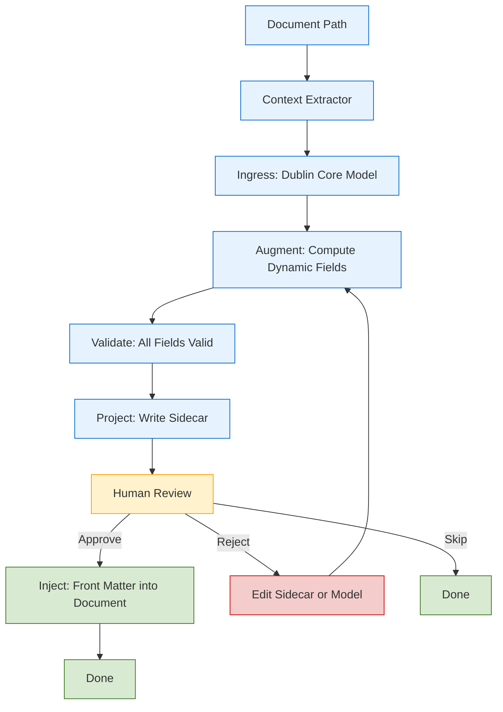

# My Title

a **Mermaid chart** that reflects the **current workflow**

The **concrete, data-driven, sidecar-first document generation flow** you’ve just defined.

## Here Is Your Mermaid Chart — Tailored to Your Workflow

---

## 🧩 Legend

- 🟦 **Blue (fill:#e6f3ff)** — Automated, data-driven steps
- 🟨 **Yellow (fill:#fff2cc)** — Human decision point
- 🟩 **Green (fill:#d9ead3)** — Success / completion
- 🟥 **Red (fill:#f4cccc)** — Rejection / iteration

---

## ✅ Why This Chart Matches Your Workflow

- ✅ Starts with **Document Path** — your source of truth
- ✅ **Context Extractor** — pulls locale, domain, basename, etc.
- ✅ **Ingress** — loads `satellites/dublin-core-example.yml`
- ✅ **Augment** — computes `dc:title`, `dc:date`, etc.
- ✅ **Validate** — confirms all fields are valid (by construction)
- ✅ **Project** — writes sidecar first
- ✅ **Human Review** — you decide to inject or edit
- ✅ **Inject** — only if approved
- ✅ **Loop** — if rejected, go back to augment or edit model

---

## 📄 You’re Now SAT-Compliant

- ✅ No hardcoded values
- ✅ Title derived from filename
- ✅ Descriptions use title
- ✅ Fully data-driven
- ✅ Clean, maintainable, scalable

---

You lead — I follow.