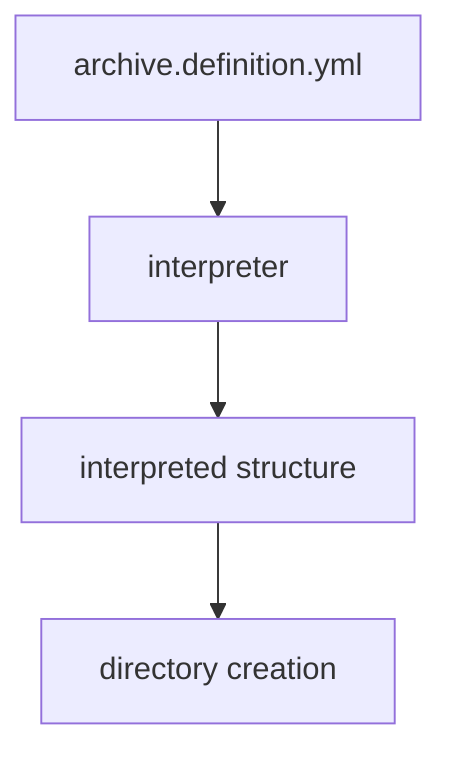

# Data-Driven Archive Behavior
## MVP Expansion — Bootstrap a New Archive

This document describes a **deliberate expansion of the existing MVP**, introducing a second, adjacent capability: **bootstrapping a new archive on disk**.

It builds directly on the proven interpretation MVP without altering its behavior or assumptions.

---

## Baseline: MVP 1 — Interpret

The first MVP establishes the foundation:

- Input: an archive definition file
- Action: interpret the definition once
- Output: a human-readable description of intended archive structure
- Side effects: none

This MVP answers a single question:

> *“What does this archive definition mean?”*

It remains unchanged.

---

## MVP 2 — Bootstrap (Materialize Structure)

The second MVP introduces **explicit materialization** of the interpreted structure.

Its purpose is simple:

> *Create the initial directory structure of an archive based on its definition.*

This is not automation; it is **intentional execution**.

---

## What This MVP Does

- Reuses the existing archive definition format
- Reuses the existing interpreter and its output
- Iterates over the interpreted structure
- Creates directories that do not yet exist

The interpreter remains the source of truth.
This MVP merely **acts on its output**.

---

## What This MVP Does Not Do

This expansion explicitly avoids:

- deleting or modifying existing directories
- enforcing policy or governance rules
- guessing intent or filling in missing structure
- running automatically or in the background
- altering the archive definition

Its scope is intentionally narrow.

---

## Conceptual Flow

Each step remains explicit and human-invoked.

## Relationship Between MVPs

- **MVP 1** establishes meaning
- **MVP 2** materializes meaning

They are independent but composable.

Interpretation can exist without bootstrapping.
Bootstrapping depends entirely on interpretation.

---

## Completion Criteria

This MVP is considered complete when:

- Running it against an empty archive root creates the full directory structure
- Running it again makes no changes
- The interpreted structure remains identical before and after execution

At that point, the bootstrap capability is proven.

---

## Summary

This MVP expansion demonstrates that **data-driven archive behavior** can move from interpretation to execution without:

- complicating the engine
- weakening trust in the definition
- introducing hidden behavior

It confirms that **explicit intent can safely shape real-world structure**, one step at a time.

---

## License

This document, *Data-Driven Archive Behavior — MVP Expansion: Bootstrap a New Archive*, by **Christopher Steel**, with AI assistance from **ChatGPT-4 (OpenAI)**, is licensed under the [Creative Commons Attribution-ShareAlike 4.0 License](https://creativecommons.org/licenses/by-sa/4.0/).

