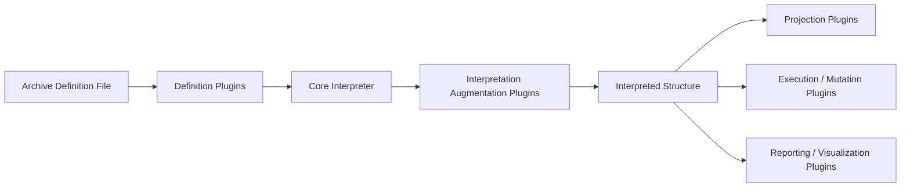

# Plugin Types and Integration Points

This document describes the **types of plugins** that may be used with the *Data-Driven Archive Behavior* MVP, the **roles they play**, and **where they attach** in the overall process.

This is a **developer-oriented overview**, not a specification.  
The intent is to clarify *where extension is possible* without constraining implementation prematurely.

## Core Process (Context)

The MVP establishes a simple, explicit flow:

1. An archive definition is read as data  
2. The definition is interpreted once  
3. A human-readable understanding of intended structure is produced  

Plugins attach **around this flow**, not inside the definition itself.

## Plugin Categories

Plugins are best understood by **what stage they attach to**, not by what technology they use.

## Definition Plugins

### Role

Definition plugins operate on the **archive definition file itself**.

They exist to help humans author, review, and reason about definitions.

### Examples

- Validate allowed fields and shapes
- Enforce naming conventions (e.g., language codes)
- Check required keys beyond the MVP minimum
- Enforce formatting or structural norms
- Gate definitions by supported schema versions

### Characteristics

- Input: raw archive definition data
- Output: pass / fail with explanation
- No filesystem access
- No interpretation logic
- No mutation

## Interpretation Augmentation Plugins

### Role

These plugins extend or enrich the **interpreted meaning** of a definition without changing the definition itself.

They add *derived structure* or annotations.

### Examples

- Expanding shorthand definitions into full structural sets
- Adding default or conventional subpaths
- Annotating interpreted paths with labels or metadata
- Injecting computed expectations (e.g., index files)

### Characteristics

- Input: parsed definition
- Output: augmented interpretation
- No filesystem mutation
- No enforcement

## Projection Plugins

### Role

Projection plugins take an **interpreted structure** and project it into another form.

They do not change reality; they *represent* intent in a different medium.

### Examples

- Render a directory tree preview
- Generate Markdown documentation
- Export JSON or YAML for other tools
- Visualize structure graphically

### Characteristics

- Input: interpreted structure
- Output: representation
- Read-only with respect to the archive

## Execution / Mutation Plugins

### Role

Execution plugins are responsible for **changing the world** based on interpreted intent.

They are always explicit and opt-in.

### Examples

- Create missing directories
- Initialize placeholder files
- Scaffold empty archive structures

### Characteristics

- Input: interpreted structure
- Output: filesystem changes + report
- Never implicit
- Never automatic

## Reporting and Visualization Plugins

### Role

These plugins improve **human understanding** of definitions, interpretations, or execution outcomes.

### Examples

- Pretty console output
- Diff-style summaries
- Tree views
- HTML or static visualizations

### Characteristics

- No effect on meaning or behavior
- Purely presentational

## Policy and Governance Plugins (Optional)

### Role

These plugins encode **organizational or social constraints**, not technical ones.

### Examples

- Enforcing required languages
- Restricting allowed domains
- Approval workflows

### Characteristics

- Context-specific
- Never hard-coded into the engine
- Always explicit

## Plugin Integration Flow

The following diagram shows **where each plugin type attaches** relative to the core MVP process.

## Key Design Insight

The interpreter remains **neutral and minimal**.

Plugins:
- constrain inputs
- enrich interpretation
- project meaning
- or apply changes

They do **not** redefine what an archive definition *means*.

## Summary

The Data-Driven Archive Behavior model supports extension by:

- clearly separating stages of responsibility
- allowing plugins to attach at specific points
- keeping the core engine small and trustworthy

This structure enables growth **without sacrificing clarity or control**.
## License

This document, *Data-Driven Archive Behavior — Plugin Types and Integration Points*, by **Christopher Steel**, with AI assistance from **ChatGPT-5.2 (OpenAI)**, is licensed under the [Creative Commons Attribution-ShareAlike 4.0 License](https://creativecommons.org/licenses/by-sa/4.0/).

