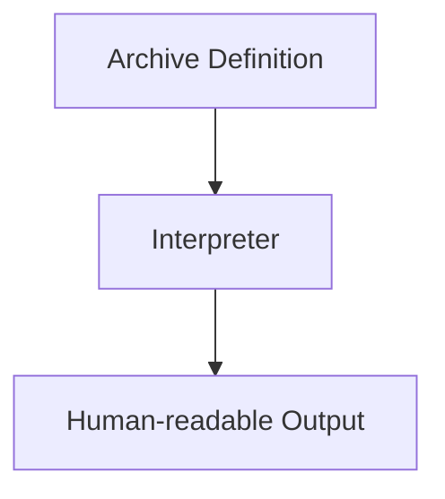
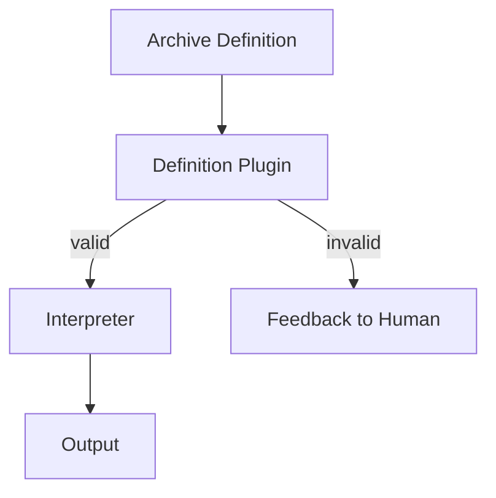
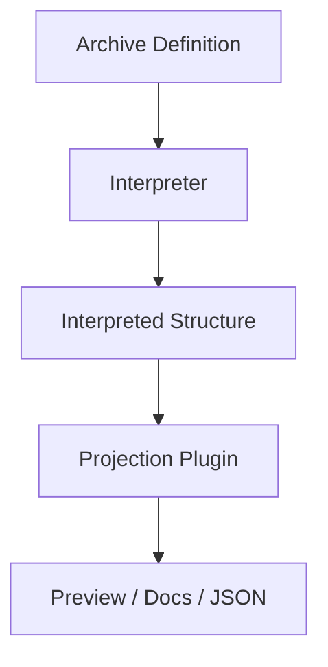
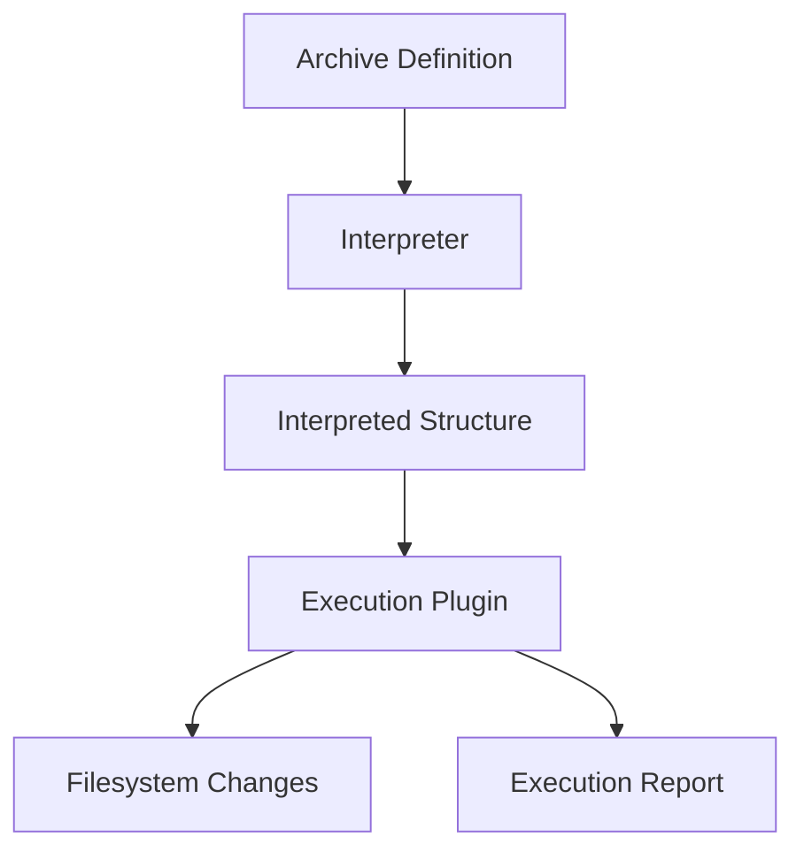
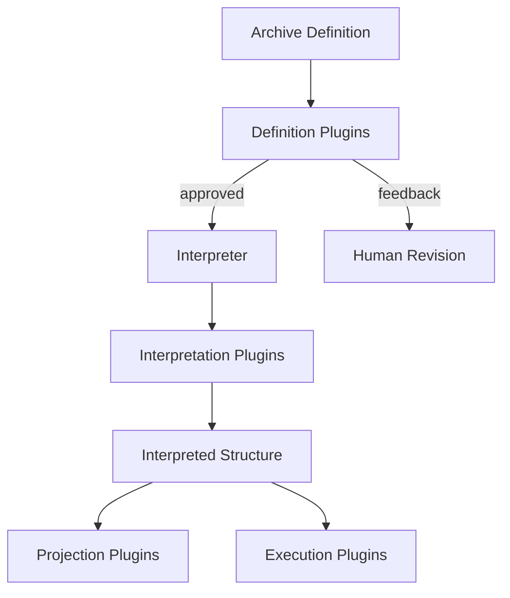
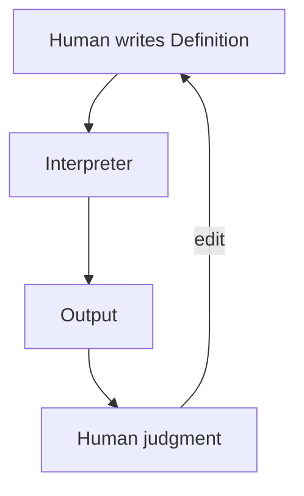

# Potential Process Flow Diagrams

Below are **several process flow diagrams** you *might* have with this approach.
They are **exploratory**, not prescriptive. Each one highlights a different way the same core pieces can be composed.

All diagrams are intentionally **linear, explicit, and human-invoked**.

## Why multiple diagrams matter

Each diagram answers a different question:

* *What’s the minimum?* → Diagram 1
* *How do we help authors?* → Diagram 2
* *How do we show meaning?* → Diagram 3
* *How do we safely change reality?* → Diagram 4
* *How does this scale conceptually?* → Diagram 5
* *Where does judgment live?* → Diagram 6

### Process Flow Notes

You don’t have to pick a single process flow. Let **use cases select the flow**.

For example you could:

* collapse these into **one canonical diagram**
* or map each diagram to a **real SAT command**
* or annotate *one* diagram for documentation use

You just decide which direction you want to go in.

---

## 1. Minimal MVP flow

This is the irreducible core and works great

**Use when**

* Exploring a definition
* Sanity-checking intent
* Teaching the model
* Zero side effects

---

## 2. Definition-assisted interpretation (linting / shaping)

Adds optional help *before* interpretation.

**Use when**

* Definitions get larger
* Multiple people author definitions
* You want clearer errors, not stricter behavior

---

## 3. Interpretation + projection (read-only)

Projects meaning into another form without changing reality.

**Use when**

* Generating previews
* Documentation
* Feeding other tools
* Visual inspection

---

## 4. Interpretation + explicit execution (mutation)

Adds *optional*, *explicit* change to the world.

**Use when**

* Creating directories
* Bootstrapping an archive
* Initializing empty structure

Key point: **execution is downstream and opt-in**.

---

## 5. Full exploratory flow (everything optional)

This shows *maximum composition* without implying obligation.

This diagram answers:

> “Where *could* plugins attach if we needed them?”

Not:

> “What must exist.”

---

## 6. Human-centered feedback loop (important perspective)

Shows the **human as the stabilizing element**, not automation.

This is arguably the **most important flow** for SAT.

---

## Key insight these diagrams share

Across all variants:

* **Definition is always the source of truth**
* **Interpreter is always neutral**
* **Plugins never replace intent**
* **Humans remain in the loop**
* **Nothing runs in the background**

