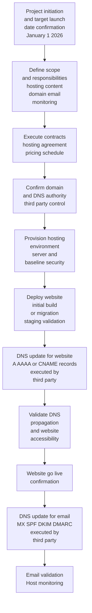

# Canonical Mermaid Flowchart Formatting Standard (SAT)

## Purpose

This document defines the **canonical formatting standard** for Mermaid flowcharts used within the Source Archive Tools (SAT) ecosystem.

Its purpose is to ensure that all Mermaid diagrams are:

- Consistent across documents and archives
- Human-readable in source form
- Stable for long-term maintenance
- Suitable for public-facing, web-ready Markdown
- Free of HTML or renderer-specific workarounds

This standard applies to **all Mermaid flowcharts** generated for SAT documentation, contracts, planning materials, and prompts.

## Scope

This standard applies specifically to:

- `flowchart` diagrams
- Top-down (`TD`) orientation
- Multi-line node labels
- Contractual, operational, and planning workflows

Other Mermaid diagram types (sequence, class, state, etc.) are out of scope unless explicitly defined elsewhere.

## Required Structure

All Mermaid flowcharts **must** follow this structure exactly:

1. A fenced Mermaid code block
2. `flowchart TD` declared on its own line
3. Node definitions using:
   - Quoted labels
   - Explicit multi-line text
   - Consistent inner indentation
4. Blank lines separating logical node blocks
5. Connections defined after all nodes

## Canonical Example

## Formatting Rules (Normative)

The following rules are **mandatory**:

- Do not use HTML (` `, ` `, `
`, etc.)
- Do not compress labels into single lines
- Do not omit quotation marks around node labels
- Do not mix indentation styles within a label
- Do not embed responsibility markers using symbols or icons
- Do not interleave edge definitions with node definitions

Wrapped lines inside a node label **must align vertically** and remain visually readable in raw Markdown.

## Design Rationale

This standard prioritizes:

- **Source readability** over compactness
- **Diff-friendly changes** in version control
- **Renderer-agnostic behavior**
- **Cognitive clarity** for technical and non-technical readers
- **Consistency across SAT-generated artifacts**

This approach intentionally avoids clever shortcuts in favor of durability and clarity.

## Usage Guidance

This formatting standard should be used when:

- Generating diagrams via prompts
- Embedding workflows in contracts or agreements
- Documenting infrastructure, governance, or responsibility boundaries
- Producing public-facing diagrams that may be reused or translated

Any deviation from this standard should be explicit, justified, and documented.

## Status

This document defines the **authoritative Mermaid flowchart formatting standard** for SAT as of its publication date.

Future extensions or amendments should be introduced as separate, versioned fragments.