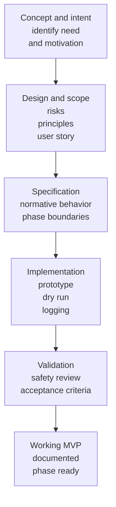

## From Concept to Working MVP

---

### Concept and Intent

Defines the originating idea, the observed problem, and why the capability is needed.

Includes:
- Initial motivation
- Problem statement
- Explicit non-goals

[Return to process chart](#from-concept-to-working-mvp-chart)

---

### Design and Scope

Establishes how the problem is approached and constrained.

Includes:
- Risk identification
- Design principles
- User story
- Safety expectations

[Return to process chart](#from-concept-to-working-mvp-chart)

---

### Specification

Defines the **contract** the implementation must satisfy.

Includes:
- Normative behavior
- Phase boundaries
- Required artifacts
- Explicit exclusions

[Return to process chart](#from-concept-to-working-mvp-chart)

---

### Implementation

Translates the specification into a working tool or system.

Includes:
- Prototype behavior
- Dry-run capability
- Change-log emission
- Failure handling

[Return to process chart](#from-concept-to-working-mvp-chart)

---

### Validation

Confirms the implementation is safe, correct, and usable.

Includes:
- Acceptance criteria
- Edge-case review
- Collision handling
- Transparency checks

[Return to process chart](#from-concept-to-working-mvp-chart)

---

### Working MVP

Declares the phase complete and ready for use.

Includes:
- Usage documentation
- Known limitations
- Clear ingress for the next phase

[Return to process chart](#from-concept-to-working-mvp-chart)

---

## License

This document, *From Concept to Working MVP*, by **Christopher Steel**, with AI assistance from **ChatGPT-4 (OpenAI)**, is licensed under the [Creative Commons Attribution-ShareAlike 4.0 License](https://creativecommons.org/licenses/by-sa/4.0/).

